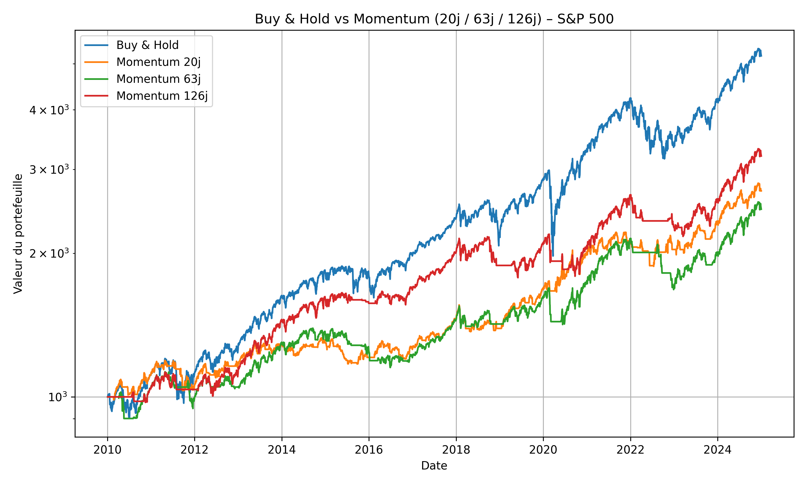
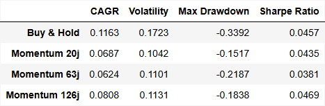

# Backtesting Momentum vs Buy & Hold sur indices boursiers

Ce projet a pour objectif de comparer la performance et le risque d’une stratégie **Momentum** à une stratégie **Buy & Hold** appliquées à des indices boursiers.  
L’analyse repose sur des métriques quantitatives telles que le **rendement annualisé**, la **volatilité**, le **drawdown maximal** et le **ratio de Sharpe** afin d’évaluer la performance ajustée au risque.

---

## 1. Contexte

Dans la littérature en finance de marché, la stratégie Momentum consiste à investir dans les actifs ayant récemment surperformé, tandis que la stratégie Buy & Hold consiste à acheter un actif et le conserver sur le long terme.  
L’objectif de ce projet est de mesurer, sur données historiques, dans quelle mesure une stratégie Momentum peut surperformer (ou non) une approche passive en termes de performance et de risque.

---

## 2. Données

- Source : données historiques d’indices boursiers récupérées via `yfinance`
- Exemple d’indices possibles :
  - S&P 500 (`^GSPC`)
  - NASDAQ 100 (`^NDX`)
  - Un indice européen (ex : `^STOXX50E`)

Les données utilisées sont :
- Prix de clôture ajustés
- Fréquence : quotidienne
- Période : à définir (par exemple, 10 à 15 ans d’historique)

---

## 3. Méthodologie

### 3.1 Stratégie Buy & Hold
- Achat de l’indice au début de la période
- Conservation sans arbitrage jusqu’à la fin
- Calcul des métriques :
  - Rendement total et annualisé
  - Volatilité
  - Drawdown maximal
  - Ratio de Sharpe

### 3.2 Stratégie Momentum (exemple)
- Calcul d’un rendement glissant sur une fenêtre (ex : 3 ou 6 mois)
- Investissement dans l’indice si le rendement passé est positif, sinon position cash (ou désinvestie)
- Rebalancing périodique (ex : mensuel)
- Calcul des mêmes métriques que pour Buy & Hold

### 3.3 Comparaison
- Comparaison des deux stratégies sur :
  - Performance brute
  - Performance ajustée au risque (Sharpe)
  - Stabilité des résultats (drawdown, volatilité)

---

## 4. Métriques utilisées

- **Rendement annualisé (CAGR)**
- **Volatilité annualisée**
- **Drawdown maximal**
- **Ratio de Sharpe** (rendement excédentaire / volatilité)

Ces métriques permettent de juger non seulement la performance brute, mais aussi le profil de risque de chaque stratégie.

---

## 5. Stack technique

- **Langage :** Python  
- **Bibliothèques principales :**
  - `pandas`
  - `numpy`
  - `matplotlib` / `plotly`
  - `yfinance`
  - éventuellement `scipy` pour certaines stats

---

## 6. Structure du projet

```text
.
├── data/                # (éventuel) fichiers CSV de données sauvegardées
├── notebooks/           # notebooks d'exploration (optionnel)
├── src/
│   ├── data_loader.py   # fonctions de récupération des données
│   ├── strategies.py    # implémentation Momentum et Buy & Hold
│   ├── metrics.py       # calcul des métriques (CAGR, Sharpe, drawdown...)
│   └── backtest.py      # logique de backtest et comparaison
└── main.py              # script principal lançant le backtest et affichant les résultats
```
## 📊 Résultats

Les stratégies Buy & Hold et Momentum ont été évaluées sur la période 2010–2025 à l’aide des métriques clés : rendement annualisé (CAGR), volatilité, drawdown maximal et ratio de Sharpe. Le tableau ci-dessous résume leurs performances :

| Stratégie         | CAGR   | Volatilité | Max Drawdown | Sharpe |
|-------------------|--------|------------|---------------|--------|
| Buy & Hold        | 0.1163 | 0.1723     | -0.3392       | 0.0457 |
| Momentum (126j)   | 0.0808 | 0.1131     | -0.1838       | 0.0469 |

### 🧠 Interprétation

Malgré un rendement annualisé plus faible que le Buy & Hold — logique dans un marché structurellement haussier comme le S&P 500 — la stratégie Momentum présente deux avantages majeurs en termes de gestion du risque :

**1. Une volatilité nettement plus faible**  
La stratégie Momentum affiche environ **35% de volatilité en moins**, ce qui se traduit par une trajectoire de portefeuille plus stable et plus prévisible.

**2. Une meilleure résistance aux phases baissières**  
Le Max Drawdown passe de **–34% pour Buy & Hold** à **–18% pour Momentum**, illustrant une réduction significative de l’exposition aux baisses de marché.

Ainsi, même si la performance brute est inférieure, la **performance ajustée au risque** (Sharpe) est légèrement meilleure pour Momentum.  
Le Momentum offre donc un compromis intéressant : *moins de performance brute mais un profil risque/rendement plus maîtrisé*.

### 📈 Visualisation

Le graphique ci-dessous compare l’évolution des portefeuilles Buy & Hold et Momentum (20j, 63j et 126j) sur une échelle logarithmique, permettant de visualiser la croissance composée et la différence de volatilité entre les stratégies.
## 📈 Visualisation des stratégies



---

## 📊 Tableau des métriques


